# Model Generation and Evaluation for Hanzi Tasks

# Results Exhibit

​										   	**VEA**                                    **DDPM**                                   **GAN**  

	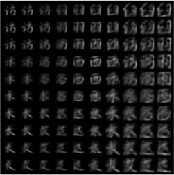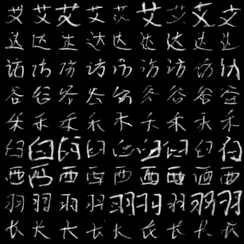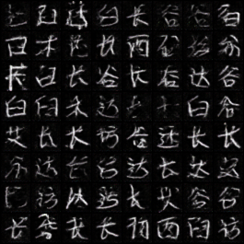

## 1. VAE  
### 1.1 Principle

$$
l_i (\theta, \phi) = -E_{z \sim q_{\theta}(z|x_i)} [\log p_{\phi}(x_i|z)] + KL(q_{\theta}(z|x_i) || p(z))
$$

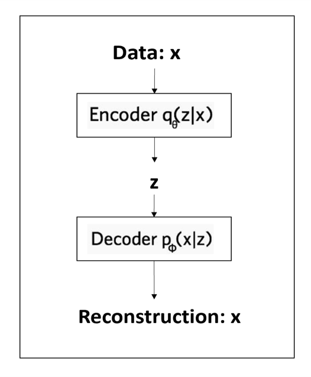

### 1.2 Latent Space Visualization

- **Advantage of VAE**:  
  - Learns a continuous representation of input data in latent space.  
  - Enables smooth transitions between different characters.  

	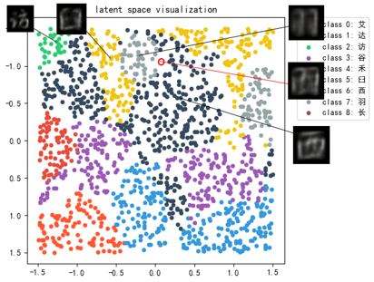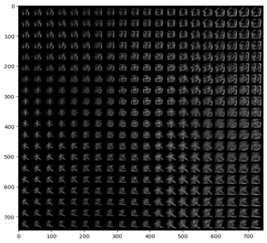

### 1.3 Training Loss

	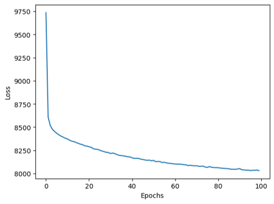

---

## 2. Diffusion Model  

### 2.1 Principle

	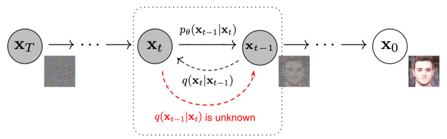
    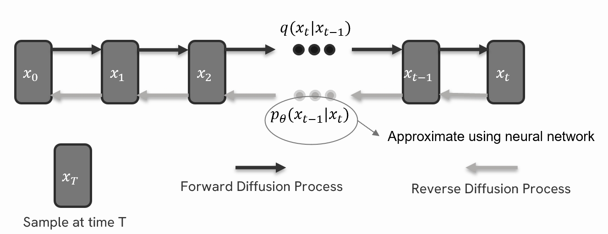

### 2.2 Diffusion Progress

### 2.3 Training Loss 

	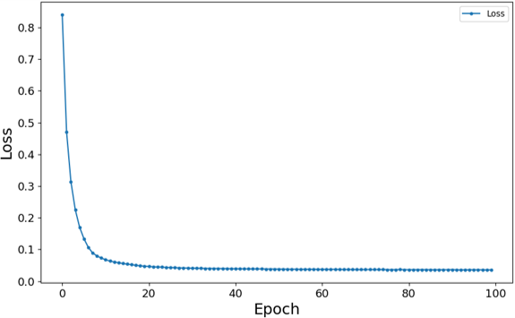

---

## 3. GAN  

### 3.1 Principle

	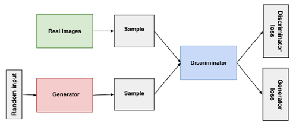

#### 3.2 Training Loss

	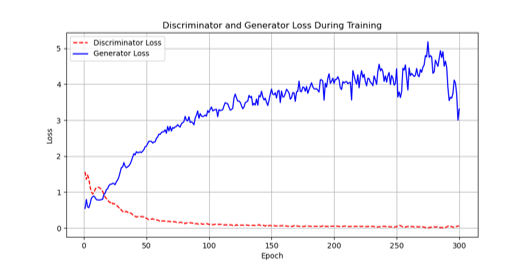

## 4. Comparison & Evaluation  
### Evaluation Metrics  

#### **Accuracy**  
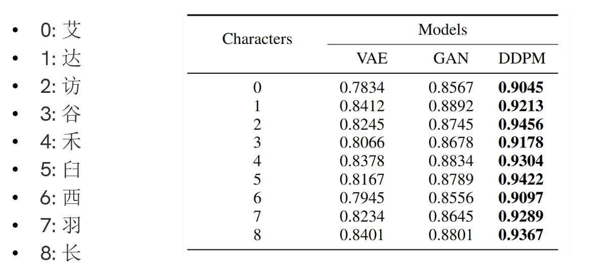

#### **Laplacian Variance as a Sharpness Indicator**  

- **Laplacian Operator**:  
  
  $$
  \nabla^2 I(x, y) = \frac{\partial^2 I(x, y)}{\partial x^2} + \frac{\partial^2 I(x, y)}{\partial y^2}
  $$
- **Laplacian Kernel**:

$$
\begin{bmatrix}0 & 1 & 0 \\ 1 & -4 & 1\\ 0 & 1 & 0 \end{bmatrix}
$$

- **Laplacian Variance**:  
  $$
  \sigma_L^2 = \frac{1}{N} \sum_{x=1}^{M} \sum_{y=1}^{N} (L(x,y) - \mu_L)^2
  $$
    

  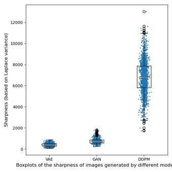

### Training Process & Results  

| Model             | VAE    | GAN            | DDPM           |
| ----------------- | ------ | -------------- | -------------- |
| **Image Quality** | Blurry | Somewhat clear | Most realistic |
| **Convergence**   | Yes    | Fluctuating    | Yes            |

### Why is VAE Blurry?  
- Trade-off between reconstruction accuracy and latent space regularization.  
- Forces the model to prioritize smoothness and continuity in latent space.  

## References  

1. Ho, J., Jain, A., & Abbeel, P. (2020). **Denoising Diffusion Probabilistic Models**. [ArXiv](https://arxiv.org/abs/2006.11239)  
2. Diederik P. Kingma & Max Welling (2013). **Auto-Encoding Variational Bayes**. [ArXiv](https://arxiv.org/pdf/1312.6114)  
3. Ian J. Goodfellow (2014). **Generative Adversarial Nets**. [ArXiv](https://arxiv.org/abs/1406.2661)  
4. K. He, X. Zhang, S. Ren, & J. Sun. **Deep Residual Learning for Image Recognition**. CVPR 2016.  
5. D. Marziliano, F. Dufaux, S. Winkler, & T. Ebrahimi. **A fast method for image sharpness assessment based on the Laplacian operator**. ICIP 2002.  
